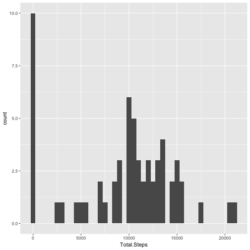
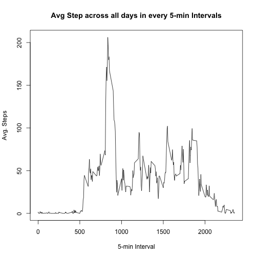
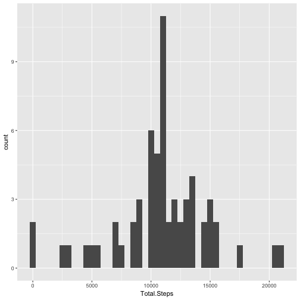
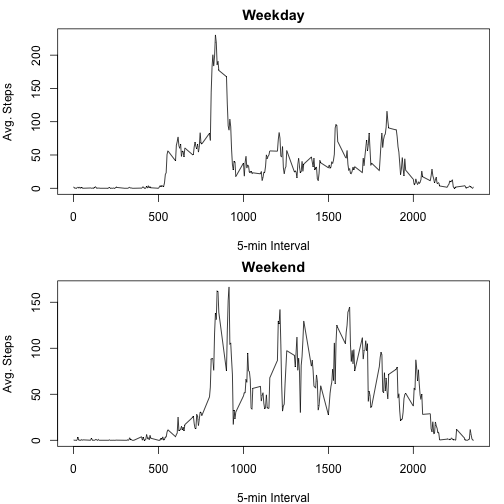

# Reproducible Research : Course Project 1

## Loading and preprocessing the data


```r
library(knitr)
library(lubridate)
library(reshape2)
library(ggplot2)

# Getting and Loading Data

setwd("/Users/siddharth/Desktop/Coursera/DataScience/C5W2")
url1 <- "https://d396qusza40orc.cloudfront.net/repdata%2Fdata%2Factivity.zip"
download.file(url = url1, destfile = paste(getwd(), "ActMonitor.zip", sep = "/"))
unzip(zipfile = "ActMonitor.zip")
Activity <- read.csv(file = "activity.csv")
Activity$date <- ymd(Activity$date)
```

## What is mean total number of steps taken per day?


```r
#Calculating Total steps per day
TotDayStep <- with(Activity, tapply(steps, date, sum, na.rm = T))

#Coverting into dataframe
TotDayStep.df <- melt(TotDayStep, varnames = "Day", value.name = "Total.Steps")

#Converting date from character to Date format
TotDayStep.df$Day <- ymd(TotDayStep.df$Day)

#plotting histogram showing total steps across days
ggplot(TotDayStep.df, aes(Total.Steps)) + geom_histogram(binwidth = 500) + guides(fill = FALSE)
```



```r
StepsByDayMean <- mean(TotDayStep.df$Total.Steps, na.rm = T)
StepsByDayMedian <- median(TotDayStep.df$Total.Steps, na.rm = T)
```

* Mean: 9354.2295082
* Median:  10395

## What is the average daily activity pattern?


```r
#Creating a dataframe that records the average steps for each 5-min Interval across days 
AvgIntervalStep.df <- melt(with(Activity, tapply(steps, interval, mean, na.rm= T)),
                           varnames = "Interval",value.name = "Avg.Step")

#Plotting the dataframe using a line plot
with(AvgIntervalStep.df, plot(Interval, Avg.Step, type = "l", ylab = "Avg. Steps", xlab = "5-min Interval",
                              main = "Avg Step across all days in every 5-min Intervals"))
```



```r
# Identifying the interval with the maximum number of Avg steps
MaxStepsInterval <- AvgIntervalStep.df[which(AvgIntervalStep.df$Avg.Step == max(AvgIntervalStep.df$Avg.Step)),
                                "Interval"]
```

Interval with Maximum Avg. Steps: 835

## Imputing missing values


```r
#Steps is the only column that contains missing data.
#Hence counting the number of rows in the column steps that contain missing values
sum(is.na(Activity$steps))
```

```
## [1] 2304
```

```r
#Creating a new dataframe to impute the missing values
Activity2 <- Activity

#Imputing the dataset
Activity2[(is.na(Activity2$steps) == TRUE), "steps"] <-  rep(AvgIntervalStep.df$Avg.Step, 8)

#Rounding the number of steps to 2 decimal places
Activity2$steps <- round(Activity2$steps, 2)

#Calculating the total steps per day after imputation
TotDayStep2 <- with(Activity2, tapply(steps, date, sum))

#Converting that into a dataframe
TotDayStep2.df <- melt(TotDayStep2, varnames = "Day", value.name = "Total.Steps")

#Converting date from character to Date format
TotDayStep2.df$Day <- ymd(TotDayStep2.df$Day)

#Plotting the Total number of steps in a day after imputation
ggplot(TotDayStep2.df, aes(Total.Steps)) + geom_histogram(binwidth = 500) + guides(fill = FALSE)
```



```r
StepsByDayMean2 <- mean(TotDayStep2.df$Total.Steps)
StepsByDayMedian2 <- median(TotDayStep2.df$Total.Steps)
```

* Mean: 1.0766181 &times; 10<sup>4</sup>
* Median:  1.076613 &times; 10<sup>4</sup>

## Are there differences in activity patterns between weekdays and weekends?


```r
#Finding the weekdays for each day and adding the results to a new column
Activity2$day <- weekdays(Activity2$date)

#Convering the day column to take two values weekday or weekend
Activity2$day <- ifelse(Activity2$day == "Saturday" | Activity2$day == "Sunday", "weekend", "weekday")

#Creating dataframe that takes the mean steps across interval and day type
WeekActivity <- aggregate(steps ~ interval+day, data = Activity2, mean)

par(mfrow = c(2,1), mar = c(4,4,2,1))
with(subset(WeekActivity, day == "weekday"), plot(interval, steps, type = "l",
                                                  xlab = "5-min Interval", ylab = "Avg. Steps", main = "Weekday"))
with(subset(WeekActivity, day == "weekend"), plot(interval, steps, type = "l",
                                                  xlab = "5-min Interval", ylab = "Avg. Steps", main = "Weekend"))
```


